NB. This is a PDF version of the online tutorial. The tutorial can be accessed either by calling the following in your RStudio (NB. requires `library(learnr)`):

```
library(remotes)
install_github("susjoh/MScIntroGitGithub")
library("MScIntroGitGithub")
learnr::run_tutorial("MSc_Intro_to_Git_and_GitHub", package = "MScIntroGitGithub")

```

or try the following link: https://susjoh.shinyapps.io/MSc_Intro_to_Git_and_GitHub/


## Introduction.

When learning to be a scientist, there are two important principles to follow:

First, **Science is not a solo endeavour** - we collaborate and share methods and data with the wider scientific community.

Second, our work must be **reproducible** with the same data - either by you or others working independently.

In this practical, we will focus on how to be good scientists and collaborators by:

* Organising data and workflows with *RStudio*
* Reproducible analyses in *R*
* Version control with *git*
* Making projects available on *GitHub*.

Before this practical, please do the following:

1. Install R for your operating system: https://cran.ma.imperial.ac.uk/ 
2. Install RStudio: https://posit.co/download/rstudio-desktop/ 
3. Install git for your operating system following the instructions here: https://git-scm.com/book/en/v2/Getting-Started-Installing-Git
4. Make a github account: https://github.com/signup

### Why use **R**?

> "This is R. There is no if. Only how."  
> -- Simon 'Yoda' Blomberg, R-help (April 2005)

There are many languages to choose, but we will focus on R. It works interactively and almost anything is possible! Along with Python, it is fast becoming the *lingua franca* of academic research, statistics and data science. It is used for:

* Processing and tidying data 
* Statistical analyses
* Data visualistion (`ggplot`)
* Creating interactive web applications (`shiny`)
* Generating reports and presentations (`knitr`, `slidify`)
* Creating portable projects (**RStudio** Projects)

The analytical power of **R** lies in its many packages (19,925 as of 25th Sep 2023). Hundreds of these are written for geoscience, ecology and evolutionary biology. A list of packages are hosted on the Comprehensive R Archive Network (known as **CRAN**): [https://cran.r-project.org/](https://cran.r-project.org/).

If you need a quick crash course in **R** after this practical, try [here](https://github.com/susjoh/E4StatsTutorials)

## Palmer Penguins.

Congratulations! You have started a new job as a research on the Palmer penguins project in sunny Antarctica. This is a publicly funded project, meaning the data and analyses should be in the public domain. You will use data from three different species of penguins and explore relationships between their morphometric traits.

Here are the penguins <3


Do you want to know more about this dataset? Click the link [here](https://allisonhorst.github.io/palmerpenguins/) for more info.


## Getting Started in **R** and **RStudio**.

### Creating an **R** Project.

An **R** Project is a stand-alone folder (*repository*) that holds all the information needed to carry out a project. Using **R** Projects (`.RProj`) allows easier file imports, improved reproducibility and collaboration. It tells **R** where to look for data files and scripts, meaning that a script can be run different machines and environments without problems.

<font color="darkblue">

### **Exercise 1**

Create a new project called `penguin_project` by selecting `File > New Project` and following the instructions. If there is an option to `Create a git repository` then click it. (If you don't have it, we will troubleshoot later in the practical.)

</font>

On the Files tab in the **lower right**, you will see the files in the current working directory.


### Structuring an **R** Project.

Using a good project layout makes life easier. There is no single way to structure a project, but an suggestion is shown here. This is based on a blog post on Nice R Code available [here](https://nicercode.github.io/blog/2013-04-05-projects/).

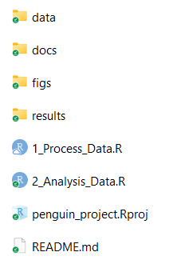

* `data` contains all data used in the analysis and should be treated as **read only** - these files should never be edited or overwritten. Rather, they should be processed within R scripts.
* `docs` contains the paper and/or reports associated with the analysis (in Word, R Markdown, LaTeX, etc).
* `figs` contains any figures generated by R scripts.
* `results` contains any simulation outputs, processed data etc. NB. Data in `figs` and `results` can be treat ed as disposable.
* `[filename].R` are R scripts. You can split your workflow into units that are logical for you, such as (a) load, merge and clean data, (b) analyse the data and (c) create outputs such as results tables and figures. Some researchers use a numbering method so that the order in which to run different scripts is clear.
* `[repository_name].Rproj` is the portable R project.
* `README.md` is a READ ME file that contains a description of the project.

<font color="darkblue">

### **Exercise 2**

a) Start to structure your R project. Download the penguin dataset [here.](https://raw.githubusercontent.com/susjoh/penguin_project/main/data/penguin_data.txt) Where should this go in your repository? 

b) Create a file called `README.md` and save it in the main directory. Write a brief description of what the project contains. You can edit this as you go. If you want to do basic formatting, look at the cheat sheet in `Help > Markdown Quick Reference`. This will appear in the *Help* tab in the lower right hand pane.

<details><summary>**Troubleshooting** [click]</summary>

If it goes to your browser instead of a download, save the text in a file `penguin_data.txt`. Use Notepad or even RStudio (Choose `New File > Text File`).

If you are really stuck with the links, go to https://raw.githubusercontent.com/susjoh/penguin_project/main/data/penguin_data.txt

</details>


</font>


### Using **RStudio**

**RStudio** should look like this. 

{width=100%}

On the **upper left** is your **R** Script - here, you can write commands and send them to the console by clicking `Run` or by typing `Ctrl-Enter`. `#` is the comment character in **R**. 

On the **lower left** is the **Console** pane - this is the engine of **R**. You can give instructions to **R** by directly typing at the prompt (`>`).

On the **upper right** is the pane for your Environment, History, Git etc.. 
  
On the **lower right**, you can browse the packages installed on your machine, open files and search **R** Help. This pane will also show plots when we run them later in the practical.


<font color="darkblue">

### **Exercise 3**

Create a new script, save it to your main directory, and start exploring your research question. Be creative! Your goals are to:

* Install and load `library(tidyverse)` (NB. This contains the packages `ggplot2` for plotting, `readr` for easier data reading, and `dplyr` for data manipulation)
* Load the penguin data into R using `read_table`
* Run some linear regressions with `lm()`
* Make and save some plots into `figs/` using `ggplot`
* Subset the data to only look at a particular species or sex.
* Save this edited dataset in `results/`.

If you are newer to R, use the hints below to get started.

If you have some experience with R, try to do this without the hints below.

If you have are experienced with R, try writing this in an Rmarkdown doc or explore the more detailed dataset in the `palmerpenguins` package in R. 

</font>


<details><summary>**Install and load tidyverse:** [click]</summary>
```
# Load the tidyverse library.

library(tidyverse)

# If the package doesn't exist, run `install.packages("tidyverse")` and then `library(tidyverse)`. You only need to run the install once.

```

</details>

<details><summary>**Read in the data:** [click]</summary>
```
penguins <- read_table("data/penguin_data.txt")
glimpse(penguins)

```
</details>

<details><summary>**Run a linear regression:** [click]</summary>
```
model1 <- lm(body_mass_g ~ flipper_length_mm, data = penguins)
summary(model1)

```
</details>

<details><summary>**Create a nice plot in ggplot2:** [click]</summary>
```
ggplot(penguins, aes(x = flipper_length_mm, y = body_mass_g, colour = species)) +
  geom_point() +
  stat_smooth(method = "lm")    

```
</details>


<details><summary>**Save the plot in your /figs folder:** [click]</summary>
```
ggsave("figs/1_flipper_bodymass_regression.png") 

#NB. This saves the last plot that was run!

```
</details>


<details><summary>**Subset the data:** [click]</summary>
```

penguins_female <- subset(penguins, sex == "female")

```
</details>

<details><summary>**Save the edited dataset:** [click]</summary>
```

write_tsv(penguins_female, "results/1_penguin_female_only.txt")

```
</details>


## Version control with `git`.

Now it's time to start doing version control.

When you look at the upper right hand pane of RStudio, you may have a tab that says **Git**. If not:

0. Check you installed git by typing `git` into the **Terminal** tab in the lower left hand pane. If nothing appears, install git to your machine using the instructions at the start of the practical.
1. Go to `Tools > Project Options... > Git/SVN > Version Control System: Select “Git”`. You will probably have to restart RStudio.
2. If this isn't an option but you installed git, try closing and re-opening RStudio.
3. Ask me and I'll try to help!

The pane should look something like this:

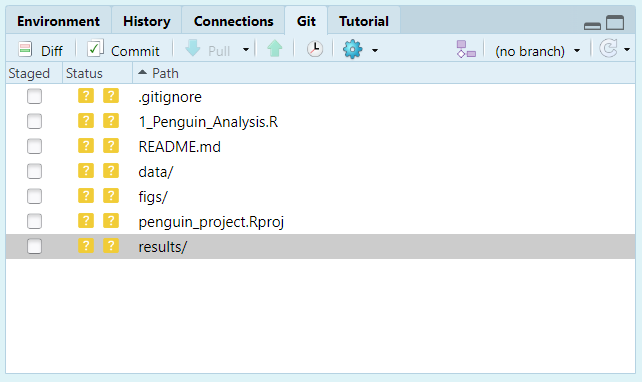

FYI: the `.gitignore` file is a text file specifying files and directories that git should ignore - for example, your .Rhistory, .RProj files and so on. For example, if you have very large data or results files, you may not want to commit them to save disk space.

### The first commit

Click on the boxes under the column `Staged`. These should turn from question marks to a green `A`. This means that you have added these files to the repository. Click `Commit`. A new dialogue should appear:

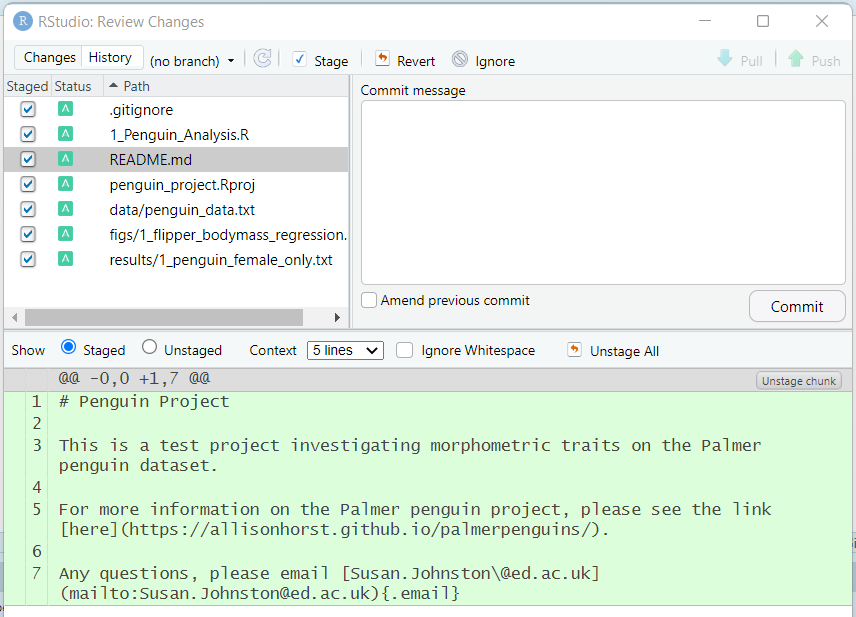{width="80%"}

Type in a commit message (such as "First commit") and click "Commit". The dialogue should clear and the `Git` tab should be empty. You have now saved a snapshot in time. You can see your History by clicking the `History` button on the Git tab (it has a little clock). 

### More commits

Let's make another commit. Edit your analysis file with something unimportant (maybe a comment) and save the file.

{width="80%"}

Now you will see your script with a blue `M` next to it. This means the file has been modified. (If you don't see it, press the little reload arrow at the far right of the pane). Stage it and commit it with a *meaningful* commit message. You will see the file changes in the lower part of the box:

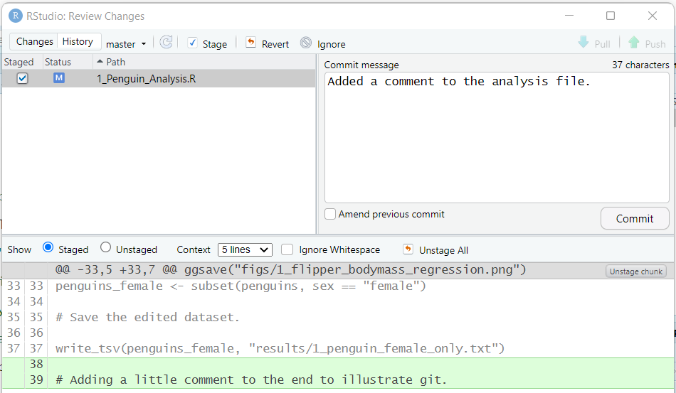{width="80%"}

Look at the history again, and you will see the new edit. As you add more commits, you can click on previous versions of files to see the previous versions. You can also filter by file in the menu `(all commits)`.

### A few comments:

**Revisiting a previous commit**: You can click on the `History` tab and click on previous versions of files at each commit. You can also filter by file in the menu `(all commits)`.

**Reverting to the last commit**: If you have made edits but want to revert back to the last save, you can click on the file in `Git` and click `More > Revert`. Use carefully as you'll lose all your changes - it's better to commit the bad stuff with a clear commit message and retrieve a previous version. We'll talk about branches in the next part.


## Uploading code to **GitHub**.

Now we can host our repository on **GitHub**.

First, for **one time only**, you will need to configure your `git` installation. You can do this by clicking on the **Terminal** tab in the bottom left pane. This takes you to the Terminal of your machine (e.g. the command line). Run the following code, editing the terms in [] to match your github account:

```
git config --global user.email [your github email address]
git config --global user.name [your github username]
```

Now log on to [GitHub](https://github.com). Navigate to your profile, click repositories, and then the green "New" button. Create a repository with the same name as your R project (e.g. `penguin_project`). Don't change anything else, and click "Create repository".


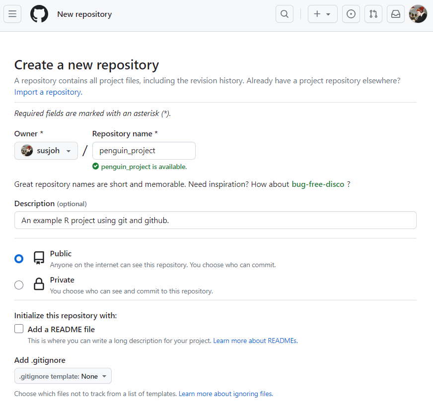{width="80%"}

You should then find the following page:

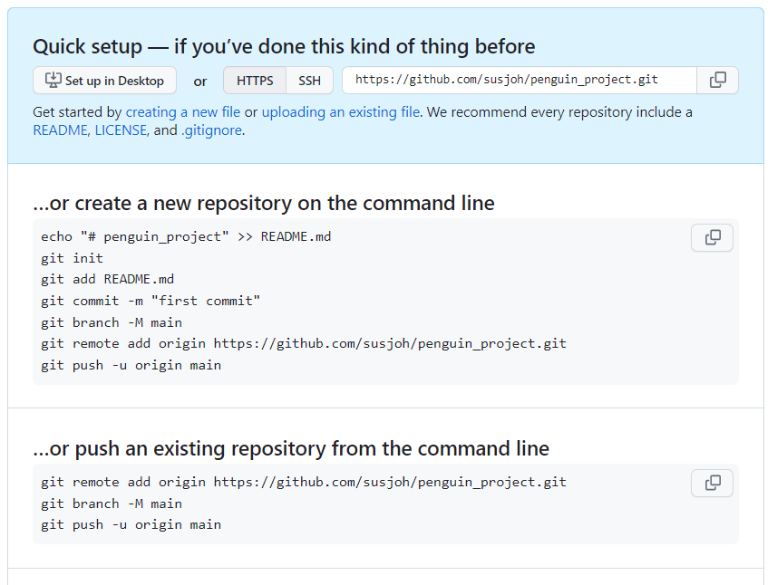{width="80%"}

Copy the code under "…or push an existing repository from the command line" and paste it into the **Terminal** window in RStudio. For example, for my username susjoh [MAKE SURE THAT YOU USE YOUR USERNAME AND NOT MINE]:

```
git remote add origin https://github.com/susjoh/penguin_project.git
git branch -M main
git push -u origin main
```

Now go back to your browser and refresh the page. It should look something like this: 

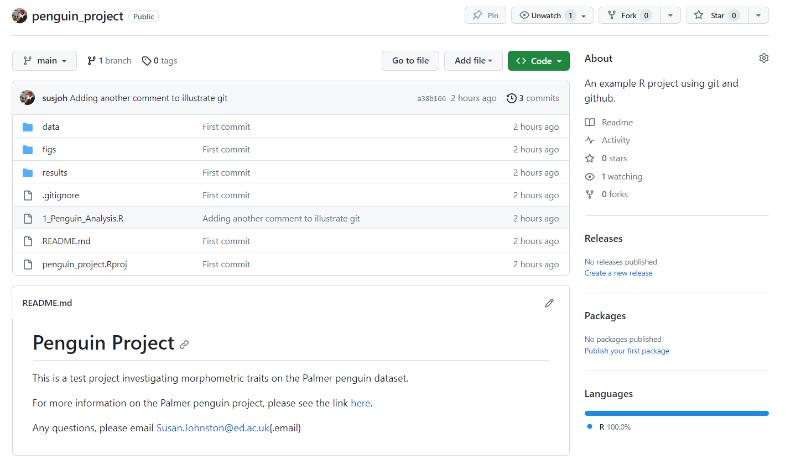{width="80%"}

### Commit, Pull, Push.

If you come back to RStudio, you should see that the buttons "Pull" and "Push" in the `git` pane are functional. This is how you will send your updates to GitHub.

Always **Pull** first. This will make sure that you have the most recent version of the repository from github. This is especially important if you work with other people. Even if you don't, it's good to get into the habit.

Then, when you have committed your changes and are happy, you can **Push** back to GitHub.


<font color="darkblue">

### **Exercise 4**

a) Make some edits to your code and commit them. Pull and push the code using the buttons. Check your GitHub repository online to see that the updates have happened.

b) Go back to your profile and admire your activity log. If you have time, why not follow your classmates GitHub accounts? Or create a README.md for your profile!

</font>

### You can also do this all in the command line!

This is the first practical of the MSc, so we are keeping things user friendly. However, it is also good practise to learn how to do this from the command line. Here are some resources to explore:

British Ecological Society guide: https://github.com/BES2016Workshop/version-control/tree/master

Software Carpentry: Getting started with `git`: https://swcarpentry.github.io/git-novice/index.html

Simon Mudd's tutorial (School of Geosciences): http://simon-m-mudd.github.io/NMDM_book/#_version_control_with_git


## Starting to collaborate - the easy way.

Now that we all have our projects on **GitHub**, we can actively invite others to collaborate on our projects with us. If you trust someone to directly work with you on a project, you can invite them as a collaborator via `Settings > Collaborators > Add People`. They will then be able to freely pull and push in the repository. There are more formal ways to do this (covered in the next two parts of the practical), but this is the easiest (and probably the most common) way.


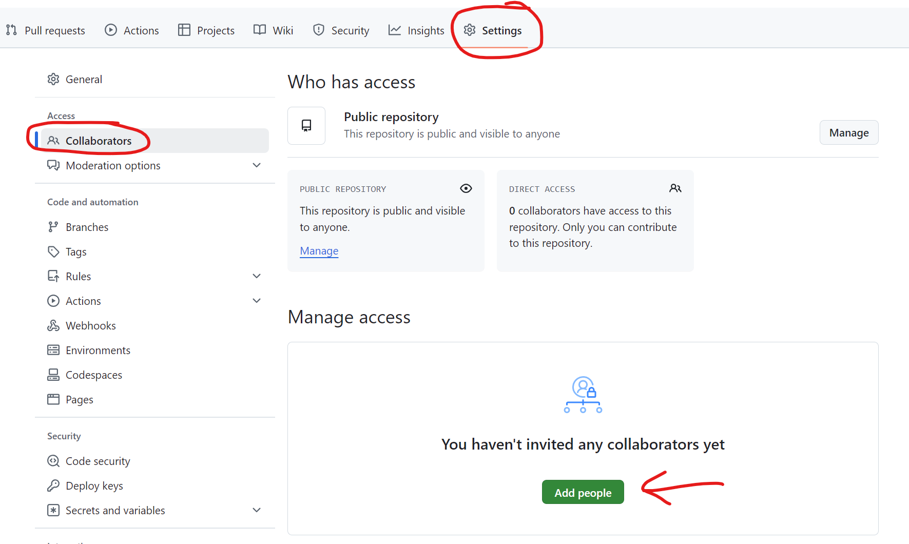{width="80%"}

## Starting to collaborate - a more formal way.

### Forking a repository.

As a fellow researcher on the Palmer penguins, I have asked for your help on my project investigating the Adelie species. My research project is stored in a repository on GitHub, accessed [here](https://github.com/susjoh/adelie_penguins).

If you want to start modifying my code, you can make a **fork**. This is a copy of a repository. Forking a repository allows you to freely experiment with changes without (directly) affecting the original project.

<font color="darkblue">

### **Exercise 5**

Follow the instructions below!

</font>

1. Create a fork by clicking the "Fork" button in the upper right of the GitHub repository. Don't change anything and click "Create fork".

2. You will now see the forked directory in your own GitHub account.

3. In RStudio, go to `File > New Project...` and select the third option `Version Control`:

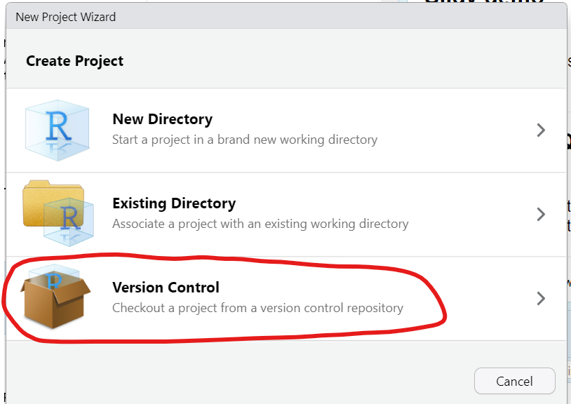{width="80%"}

4. Select `Git` and then enter the URL of the directory you forked. For example:

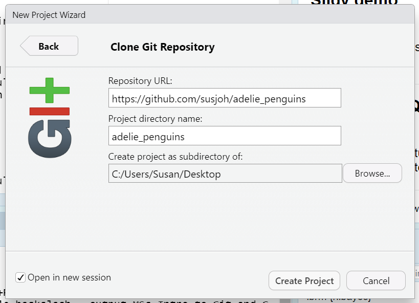{width="80%"}


4. You will see in the "Git" pane, the Pull and Push buttons should be functional. You can now sync any changes you made with your project fork on your own directory.

5. Make some edits, commit them, and **Push**.


### Pull requests: contributing to the original project.

Now you may want to suggest to your collaborator that they should accept the changes you made. We can do this by creating a pull request as before.

You will notice that on your forked repository on GitHub, you will see a message saying "This branch is 1 commit ahead of susjoh:master.". If you click the "Contribute" button, you can "Open pull request" and then "Create a pull request".

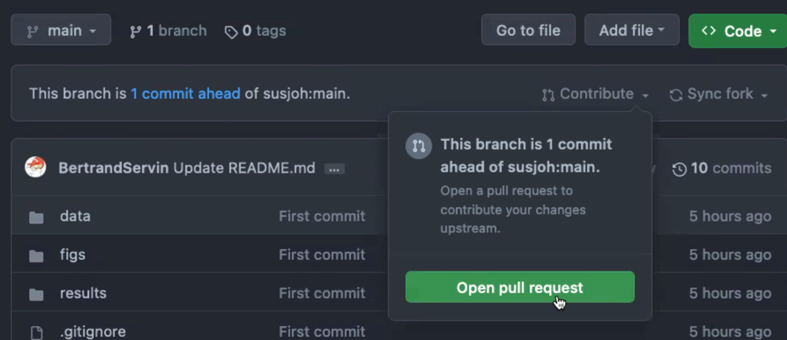{width="80%"}

I then receive a notification about the request. I can click on it, review it, and then merge the pull request.

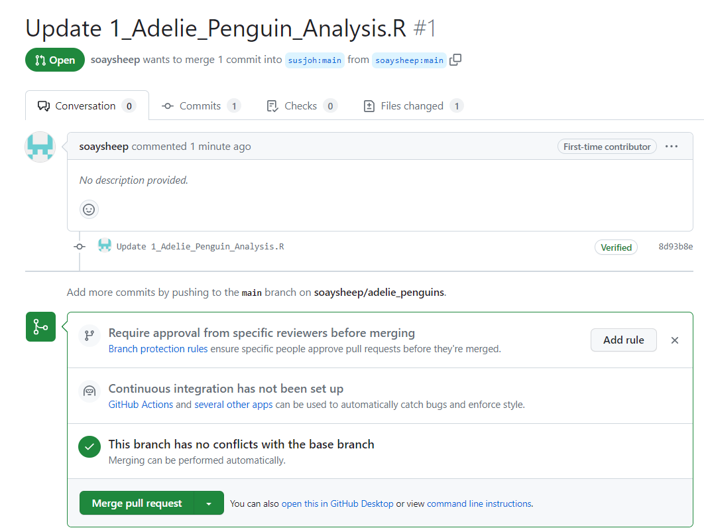{width="80%"}

You now need to sync the fork with the original project by pressing the button on the left and confirming:

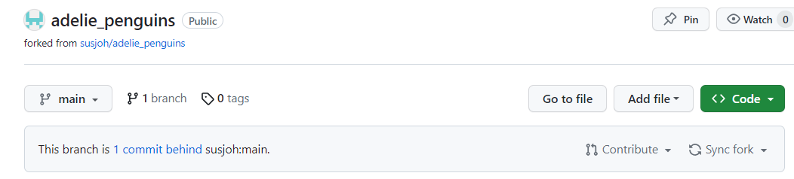{width="80%"}

Finally, we can both **Pull** the updated project back to our machines. If you click on the History button, the pull and merge can be seen:

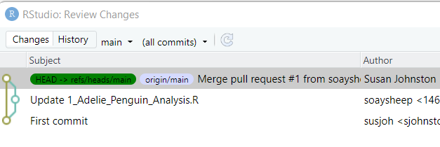{width="80%"}


<font color="darkblue">

### **Exercise 6**

Feeling strong? Why not pair up as collaborators on your projects.

</font>


## Creating a branch.

There are a few reasons why you want to create a branch. Maybe you are about to make a big edit to the analysis that you may not necessarily commit to, but could be merged back into the repository. Or, you are a (direct) collaborator making a request to change some code - you do this on a branch, which can then be merged back by the owner of the repository.

*NB. This is a bit complicated to keep track of, so pay attention to each step. If you find/know an easier way, please let me know!*

<font color="darkblue">

### **Exercise 7**

Follow the instructions below!

</font>

1. Let's create a branch on your project. Go to the GitHub page for your project and click the button "1 branch". Then click the green "New branch" button and name your new branch.

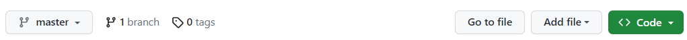{width="80%"}


2. Come back to RStudio and "Pull". You should see information that you have a new branch added.

3. Switch to the branch by clicking on the **Git** menu as so:

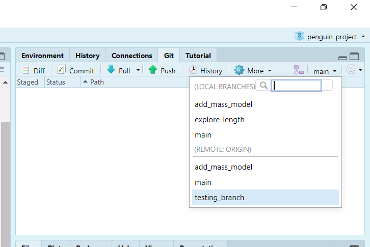{width="80%"}

4. Edit your script e.g. by adding a new model, comment, or so on. Commit the change and **Push!**

5. Navigate back to the GitHub repo page. It should look like the image below. Click the "Compare and pull request button". It should say that the branches can be automatically merged. Click "Create pull request", then "Merge pull request", confirm your details.

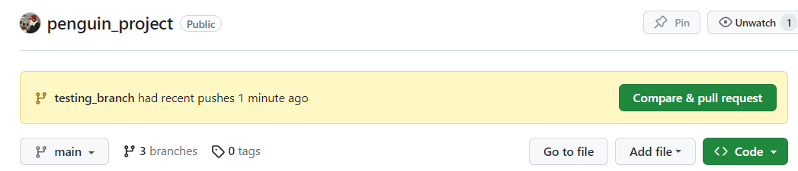{width="80%"}


6. Come back to RStudio and **Pull!**. Switch back to the main branch in the small dropdown menu. **Pull** again. Now you will be able to see the branches in your git History:

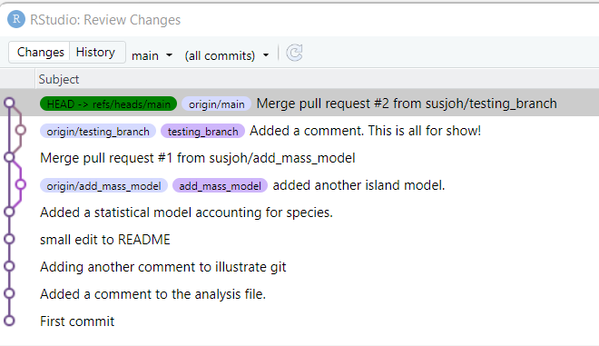{width="80%"}


